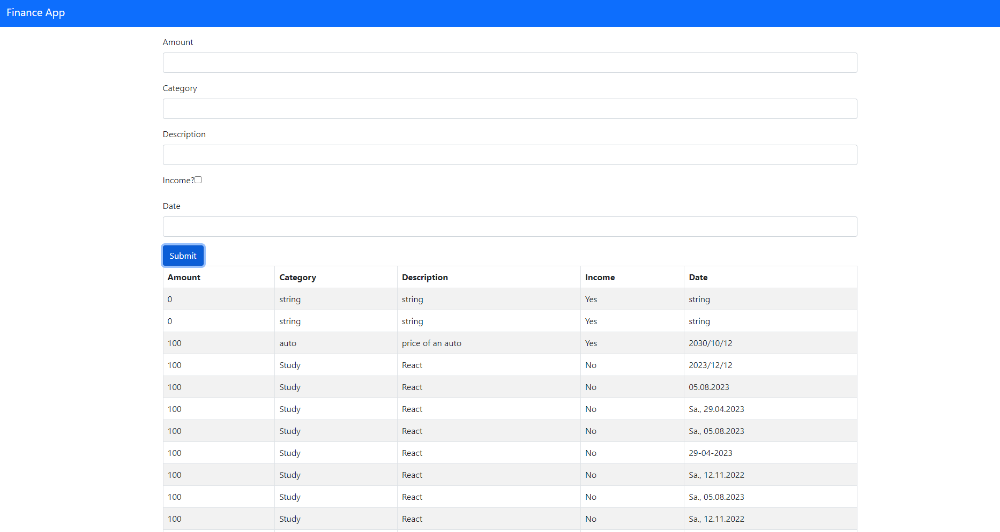

# Finance Tracker App

This repository contains a Finance Tracker application built using FastAPI for the backend, React for the frontend, and SQLAlchemy for database interaction.

## Features

- **FastAPI Backend:**
  - Utilizes FastAPI to provide a robust backend API.
  - Endpoint documentation available at [http://127.0.0.1:8000/docs](http://127.0.0.1:8000/docs).

- **React Frontend:**
  - Created with `npx create-react-app finance-app`.
  - Frontend interface available at [http://localhost:3000/](http://localhost:3000/).
  - Allows users to input financial data via a form.
  - Provides checkboxes for categorization (income, expenses).
  - Displays database entries and supports CRUD operations.

## Getting Started

### Backend (FastAPI)

1. Navigate to the `FastAPI` folder.
2. Activate the Python virtual environment (if not already activated):
    ```bash
    source env/Scripts/activate
    ```
3. Install required Python packages:
    ```bash
    pip install -r requirements.txt
    ```
4. Start the FastAPI server:
    ```bash
    uvicorn main:app --reload
    ```

### Frontend (React)

1. Navigate to the `React/finance-app` folder.
2. Start the React development server:
    ```bash
    npm install
    npm start
    ```

### Accessing the Application

- **Backend:**
  - Explore API endpoints at [http://127.0.0.1:8000/docs](http://127.0.0.1:8000/docs).
  - Perform CRUD operations using PUT and GET HTTP commands.

- **Frontend:**
  - Access the application interface at [http://localhost:3000/](http://localhost:3000/).
  - Input financial data via the form, including amount, category, description, and date information.
  - View and interact with the database entries.

## Notes

- The `env` folder containing the Python virtual environment is ignored to maintain security and privacy.
- For further details on setup, installation, and project structure, refer to the project's code and documentation.



